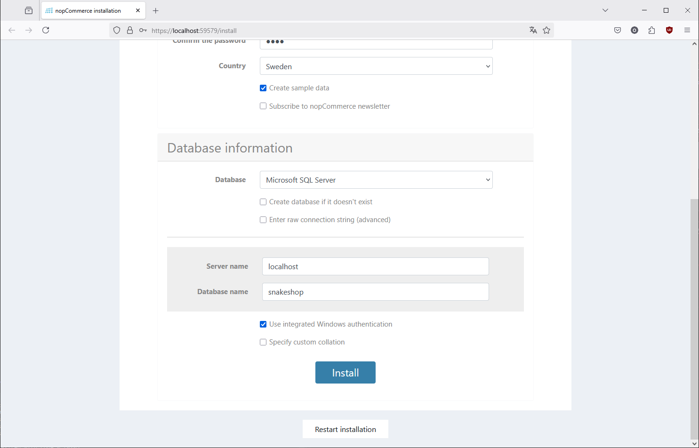
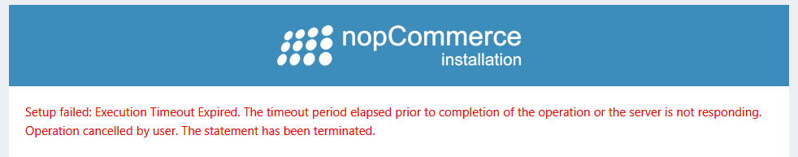
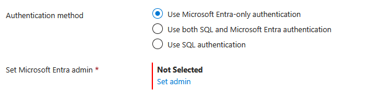
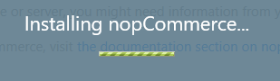
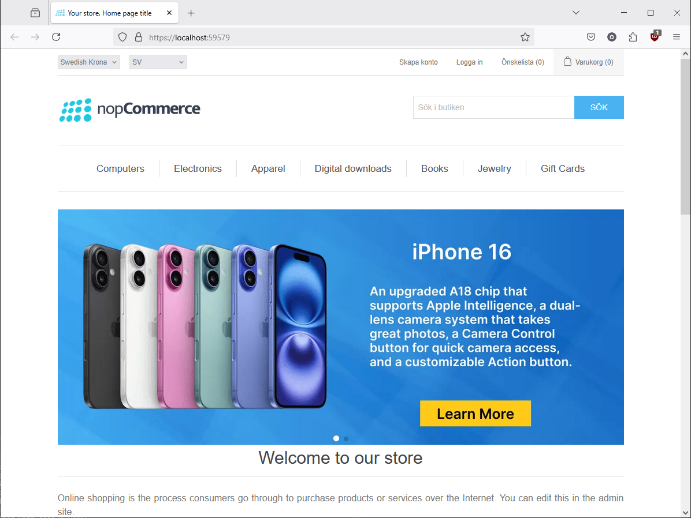

Okay, so I cloned the NopCommerce repository and installed Microsoft SQL Server Developer version along with SMSS.

I opened the NopCommerce .sln file in Visual Studio and hit the play button. After a while a browser window popped up with the NopCommerce installation thing.

Coolbeans, I filled out the required fields and pointed towards the SQL Server instance and hit the install button.

So far so good...

So, my slow computer failed to create the database due to a timeout error. 

I contemplated my options, should I try to change the timeout settings or try a different approach?

I thought maybe Azure had some cheap SQL service so I checked it out and found that I could get a free SQL Server with like 32gb memory and 100k seconds of CPU time a month, and 28 hours feels like way more than I need considering I wont do thaat many requests n whatnot.

So I configured an Azure SQL Server and most options were pretty straightforward.

]

Uhm, what is this sorcery? Entra?

After some research I found out that Entra is the new name for Azure Active Directory and well that shouldnt be needed for now, so I used SQL authentication instead.

]

So, the connectivity huh, I mean it shouldnt be free for all so private sounds good right?

Nuh uh!

I found out the following:

- No one => No one can connect to the database, not even me.
- Private => Only connections from within the Azure network can connect to the database.
- Public => Anyone can connect to the database, but only if they have the login/password.

So public it is!

Okay, so the name of database and then .database.microsoft.net so since I called the database nopsql its nopsql.database.microsoft.net to connect to it.

Time for another try!

Tumtidum, lets see if it works now... aaand... browser window closed?

Did it work or what? bit strange eh.

I went back to Visual Studio and checked the output window and no errors were shown, so I guess it worked?

I hit the play button again and...

We have liftoff! Finally the test webshop is up and running. Tomorrow I will start exploring the site more and check out some code!